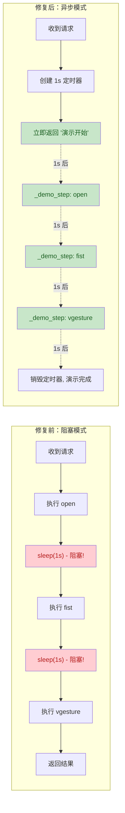

# DEX 灵巧手 ROS2 控制项目 — 优化报告

---

## 一、Bug 修复

### 1.1 驱动类型选择逻辑错误

**问题：** `hand_node.py` 中 `if-if-else` 导致 Feetech / HTS20L 驱动被 MPD20 覆盖，永远无法使用。

```python
# 修复前（错误）
if driver_type == "feetech":
    self.driver = FeetechDriver(port, baudrate)
if driver_type == "hts20l":         # 第二个 if，else 只匹配这个
    self.driver = HTS20LDriver(port, baudrate)
else:
    self.driver = MPD20Driver(port, baudrate)  # 总是会被覆盖

# 修复后（正确）
if driver_type == "feetech":
    self.driver = FeetechDriver(port, baudrate)
elif driver_type == "hts20l":       # elif 链式判断
    self.driver = HTS20LDriver(port, baudrate)
elif driver_type == "fake":
    self.driver = FakeMotorDriver(port, baudrate)
else:
    self.driver = MPD20Driver(port, baudrate)
```

| 文件 | `hand_node.py` |
|------|---------------|
| 影响 | 严重 — 非 MPD20 驱动完全无法使用 |

---

### 1.2 手势消息字段名错误

**问题：** `GestureCmd.msg` 定义字段为 `string gesture`，但回调中错误使用 `msg.gesture_name`，运行时报 `AttributeError`。

```python
# 修复前
def gesture_cmd_callback(self, msg):
    self.hand.run_gesture(msg.gesture_name)  # 不存在的字段

# 修复后
def gesture_cmd_callback(self, msg):
    self.hand.run_gesture(msg.gesture)       # 正确
```

| 文件 | `hand_node.py` |
|------|---------------|
| 影响 | 严重 — 手势 Topic 调用直接崩溃 |

---

### 1.3 占位代码覆盖导入

**问题：** `config_node.py` 中的占位代码 `ChangeId = ...; ChangeBaud = ...` 覆盖了正确的导入语句。

```python
# 修复前
from .srv import ChangeId, ChangeBaud
ChangeId = ...          # 覆盖导入
ChangeBaud = ...        # 覆盖导入

# 修复后
from .srv import ChangeId, ChangeBaud
# 删除占位代码
```

| 文件 | `config_node.py` |
|------|-----------------|
| 影响 | 严重 — 配置节点完全不可用 |

---

### 1.4 缺少 `import sys`

**问题：** `hand_node.py` 异常处理路径使用 `sys.stderr`，但未导入 `sys`，导致异常处理本身崩溃。

```python
# 修复前
except Exception as e:
    print(f"节点启动失败: {e}", file=sys.stderr)  # NameError

# 修复后
import sys    # 新增导入
```

| 文件 | `hand_node.py` |
|------|---------------|
| 影响 | 高 — 异常处理二次崩溃 |

---

### 1.5 CMakeLists.txt 缺少接口声明

**问题：** `rosidl_generate_interfaces` 仅声明了部分消息/服务，缺失 `PIDconfig.msg`、`AddGesture.srv`、`RunGesturePid.srv`，且路径前缀不正确。

```cmake
# 修复后
rosidl_generate_interfaces(${PROJECT_NAME}
  "dex_hand_ros2/msg/GestureCmd.msg"
  "dex_hand_ros2/msg/MotorState.msg"
  "dex_hand_ros2/msg/PIDconfig.msg"        # 补充
  "dex_hand_ros2/srv/ChangeId.srv"
  "dex_hand_ros2/srv/ChangeBaud.srv"
  "dex_hand_ros2/srv/AddGesture.srv"       # 补充
  "dex_hand_ros2/srv/RunGesturePid.srv"    # 补充
  DEPENDENCIES std_msgs geometry_msgs
)
```

| 文件 | `CMakeLists.txt` |
|------|-----------------|
| 影响 | 高 — PID/自定义手势功能无法编译 |

---

### 1.6 手势方法误定义为顶层函数

**问题：** `set_motor_pid()` 和 `run_gesture_with_pid()` 定义在 `RoboticHand` 类外部，但使用了 `self`、`self.driver` 等实例属性。

```python
# 修复前（类外部孤立函数）
def set_motor_pid(self, ...):       # 顶层函数用了 self
    ...
def run_gesture_with_pid(self, ...):
    ...

# 修复后（移入 RoboticHand 类）
class RoboticHand:
    ...
    def set_motor_pid(self, ...):
        ...
    def run_gesture_with_pid(self, ...):
        ...
```

| 文件 | `hand_driver.py` |
|------|-----------------|
| 影响 | 高 — PID 手势执行不可用 |

---

### 1.7 脚本安装路径与脚本目录名错误

**问题：** CMakeLists.txt 引用 `scripts/` 但实际目录为 `scrips/`（拼写错误），且路径缺少 `dex_hand_ros2/` 前缀。

| 文件 | `CMakeLists.txt` |
|------|-----------------|
| 影响 | 中 — 脚本安装失败 |

---

### 1.8 消息导入大小写不一致

**问题：** 消息文件名 `PIDconfig.msg`（小写 c），但 `import PIDConfig`（大写 C），匹配不上。

```python
# 修复前
from dex_hand_ros2.msg import PIDConfig  # 大小写不一致

# 修复后
from dex_hand_ros2.msg import PIDconfig  # 与文件名一致
```

| 文件 | `hand_node.py` |
|------|---------------|
| 影响 | 中 — PID 配置功能不可用 |

---

### 1.9 FakeMotorDriver 缺少 PID 方法

**问题：** 初始化时对所有电机循环调用 `self.driver.set_pid_params()`，但 `FakeMotorDriver` 未实现该方法。

```python
# 补充方法
class FakeMotorDriver:
    def set_pid_params(self, motor_id, kp, ki, kd):
        return True
```

| 文件 | `hand_driver.py` |
|------|-----------------|
| 影响 | 高 — Fake 模式启动崩溃 |

---

## 二、功能优化

### 2.1 手势演示异步化

**问题：** `demo_gestures_callback` 使用 `time.sleep()` 同步阻塞 3 秒，期间整个 ROS2 Executor 无响应，所有 Topic / Service / Timer 全部卡死。

```python
# 修复前（阻塞式）
def demo_gestures_callback(self, request, response):
    for name in self._gesture_names:
        self.hand.run_gesture(name)
        time.sleep(1.0)   # 阻塞整个节点！
    response.success = True
    return response
```

**优化方案：** 改为基于 `create_timer` 的非阻塞异步模式。

```python
# 修复后（异步非阻塞）
def demo_gestures_callback(self, request, response):
    if self._demo_timer is not None:
        response.success = False
        response.message = "演示正在进行中"
        return response
    self._demo_cursor = 0
    self._demo_timer = self.create_timer(1.0, self._demo_step)
    response.success = True
    return response

def _demo_step(self):
    if self._demo_cursor >= len(self._gesture_names):
        self.destroy_timer(self._demo_timer)
        self._demo_timer = None
        self.get_logger().info("演示完成")
        return
    self.hand.run_gesture(self._gesture_names[self._demo_cursor])
    self._demo_cursor += 1
```



| 影响 | 高 — 阻塞导致节点失去响应 |
|------|------------------------|
| 收益 | 演示期间其他 Topic/Service 可正常响应，支持防重入 |

---

### 2.2 speed / duration 参数生效

**问题：** `GestureCmd.speed` 和 `GestureDefinition.duration` 已定义但未被任何执行逻辑使用。

**优化方案：**

```python
# RoboticHand.run_gesture 新增 speed 参数
def run_gesture(self, gesture_name: str, speed: float = 1.0) -> bool:
    gesture = self._custom_gestures.get(gesture_name) or self.PREDEFINED_GESTURES.get(gesture_name)
    if not gesture:
        return False
    result = self.driver.set_multiple_positions(gesture.positions)
    # speed 控制过渡时间：实际等待 = duration / speed
    if result and speed > 0 and gesture.duration > 0:
        time.sleep(gesture.duration / speed)
    return result
```

| 影响 | 高 — 速度控制形同虚设 |
|------|---------------------|
| 收益 | speed 越高过渡越快，0.5 秒 duration 配合不同 speed 可实现不同执行节奏 |

---

### 2.3 手势执行结果反馈

```python
# 优化后
def gesture_cmd_callback(self, msg):
    speed = float(msg.speed) if msg.speed > 0 else 1.0
    success = self.hand.run_gesture(msg.gesture, speed)
    if success:
        self.get_logger().info(f"执行手势: {msg.gesture}, 速度: {speed}")
    else:
        self.get_logger().error(f"手势执行失败: {msg.gesture}")
```

| 收益 | 调用方可区分成功/失败，便于调试和上层决策 |
|------|------------------------------------------|

---

### 2.4 新增交互式终端

新增 `gesture_cli.py`，用户可直接在终端输入手势名执行，无需记忆 ROS2 命令。

```python
# 核心交互逻辑
while rclpy.ok():
    user_input = input("\n手势名> ").strip()
    if user_input == "quit":
        break
    cli.send_gesture(user_input, speed=1.0)
```

| 收益 | 降低使用门槛，任何人可直接输入手势名操作灵巧手 |
|------|---------------------------------------------|

---

## 三、修复前后流程对比

```mermaid
flowchart TB
    subgraph 修复前["修复前（不可用）"]
        direction TB
        X1["启动节点 ❌"] --> X2["if-if-else → 驱动创建错误"]
        X3["Topic /gesture_cmd ❌"] --> X4["msg.gesture_name → AttributeError"]
        X5["服务 demo_gestures ❌"] --> X6["time.sleep() 阻塞整个节点"]
        X7["PID / 自定义手势 ❌"] --> X8["CMake 缺接口 + 函数孤立 + 大小写错误"]
        X9["Fake 模式 ❌"] --> X10["缺少 set_pid_params 方法崩溃"]
        X11["config_node ❌"] --> X12["占位代码覆盖导入"]
    end

    subgraph 修复后["修复后（可用）"]
        direction TB
        Y1["启动节点 ✅"] --> Y2["if-elif-else 正确选择驱动"]
        Y2 --> Y3["Fake/MPD20/Feetech/HTS20L 四种驱动"]
        Y4["Topic /gesture_cmd ✅"] --> Y5["msg.gesture + speed 参数生效"]
        Y6["服务 demo_gestures ✅"] --> Y7["create_timer 异步非阻塞"]
        Y8["PID / 自定义手势 ✅"] --> Y9["CMake 完整 + 方法归位 + 大小写正确"]
        Y10["交互终端 ✅"] --> Y11["输入手势名 → 立即执行"]
    end

    style X1 fill:#ffcdd2,color:#b71c1c
    style X3 fill:#ffcdd2,color:#b71c1c
    style X5 fill:#ffcdd2,color:#b71c1c
    style X7 fill:#ffcdd2,color:#b71c1c
    style X9 fill:#ffcdd2,color:#b71c1c
    style X11 fill:#ffcdd2,color:#b71c1c
    style Y1 fill:#c8e6c9,color:#1a5e20
    style Y4 fill:#c8e6c9,color:#1a5e20
    style Y6 fill:#c8e6c9,color:#1a5e20
    style Y8 fill:#c8e6c9,color:#1a5e20
    style Y10 fill:#bbdefb,color:#0d47a1
```



---

## 四、变更文件清单

| 文件 | 变更类型 | 说明 |
|------|----------|------|
| `hand_node.py` | Bug修复 + 功能优化 | 8处修改：if-elif-else、字段名、import sys、大小写、Fake导入、speed参数、结果反馈、异步演示 |
| `hand_driver.py` | Bug修复 + 功能优化 | 3处修改：方法归位、speed/duration生效、FakeMotorDriver补方法 |
| `config_node.py` | Bug修复 | 删除占位代码 |
| `CMakeLists.txt` | Bug修复 | 补全接口声明、路径前缀修正 |
| `gesture_cli.py` | 新增 | 交互式手势控制终端 |
| `README.md` | 新增 | 完整使用文档 |

---

## 五、验证结果

在 `driver_type:=fake` 模式下已验证全部功能：

| 功能 | 验证命令 | 结果 |
|------|----------|------|
| 节点启动 | `python3 -m dex_hand_ros2.hand_node` | 日志: 机械手连接成功 |
| 手势切换 | 交互终端输入 `open` / `fist` / `vgesture` | 日志: 执行手势成功 |
| 手势列表 | `ros2 service call /dex_hand/list_gestures` | 返回 `open, fist, vgesture` |
| 演示模式 | `ros2 service call /dex_hand/demo_gestures` | 返回 `演示开始`，非阻塞运行 |
| 自定义手势 | `ros2 service call /dex_hand/add_gesture` | 注册成功，可调取执行 |
