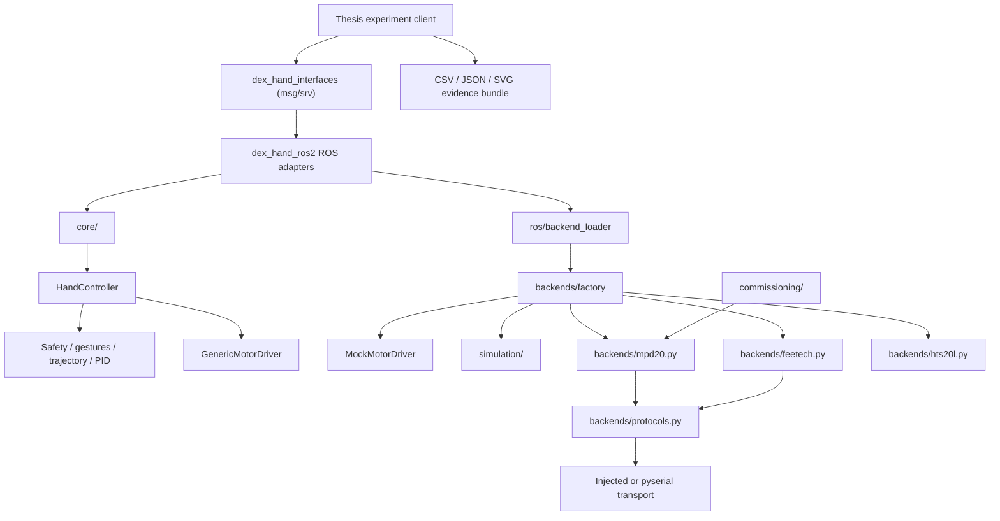
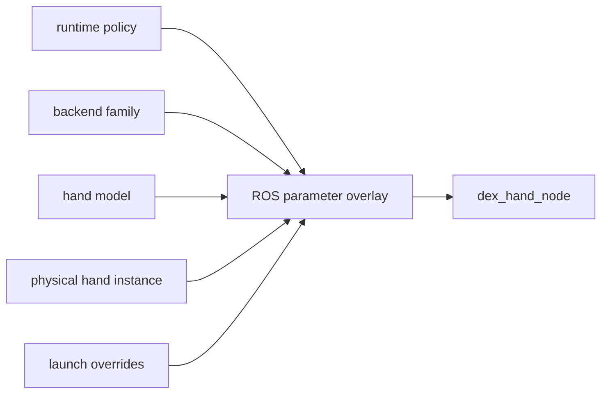
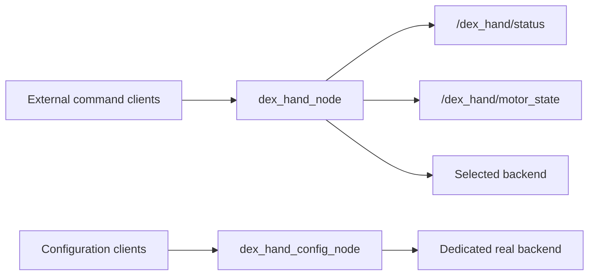
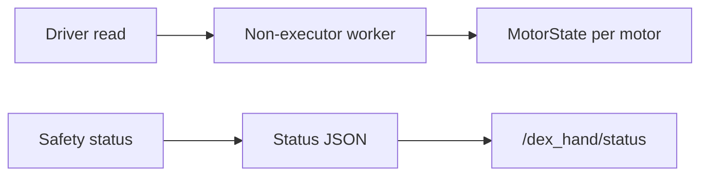

# Current Architecture

## Implemented package architecture

Legacy top-level modules such as `driver.py`, `real_drivers.py` and
`sim_driver.py` are compatibility import layers. New implementation code
imports from `core/`, `backends/`, or `simulation/`.

## Configuration overlay

- `runtime/` owns control, safety and QoS policy.
- `backends/` owns protocol/transport startup settings.
- `hand_models/` owns logical axes, joint mapping and gestures.
- `deployments/` owns serial path, physical device IDs and calibration.

For MPD20, `motor_ids` are reusable logical axes and `mpd20_device_ids` are
per-hand Modbus addresses. The backend resolves that mapping before every bus
operation.

## Node topology

The hand and configuration nodes should not open the same serial device
simultaneously.

For MPD20, the normalized control domain is mapped per motor to calibrated raw
register limits. Physical startup is read-only by default, probes every ID with
function 04, requires stationary feedback, and needs an explicit motion gate.
Stop, watchdog, consecutive feedback-failure and shutdown paths request an
active hold by rewriting measured raw positions as targets. This is not a
hardware torque-off function.

## Command flow

## Feedback flow

## Remaining boundary

The nominal URDF/RViz and Revo2 assets remain model-specific. A future verified
physical description can move into a separate ROS description package without
changing `core/` or the motor backends.
