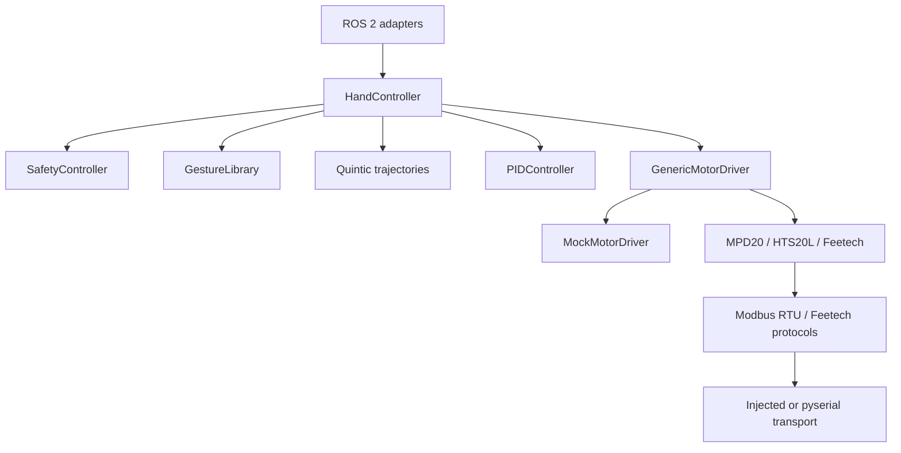
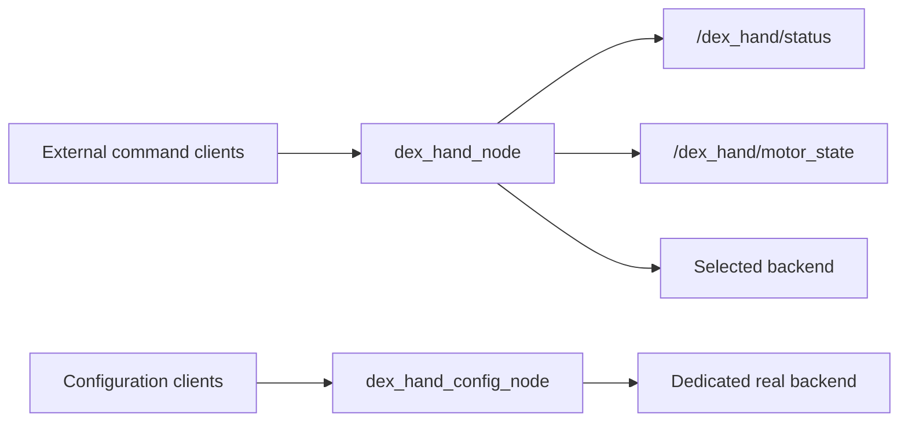
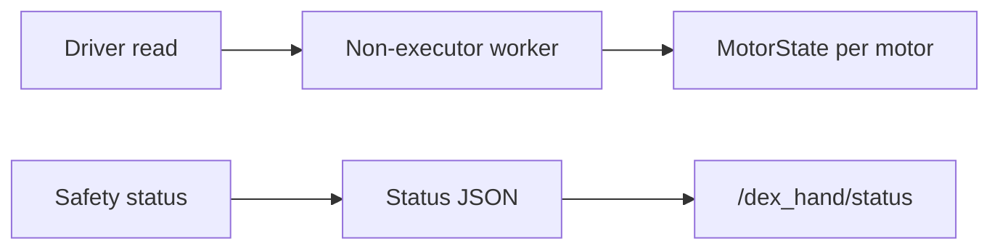

# Current Architecture

## Implemented package architecture

## Node topology

The hand and configuration nodes should not open the same serial device
simultaneously.

## Command flow

## Feedback flow

## Proposed target architecture

After a verified URDF and motor-to-joint mapping exist, a separate description
package may add `robot_state_publisher`, `JointState`, TF, RViz, and standard
joint trajectory interfaces. None are part of the current architecture.
